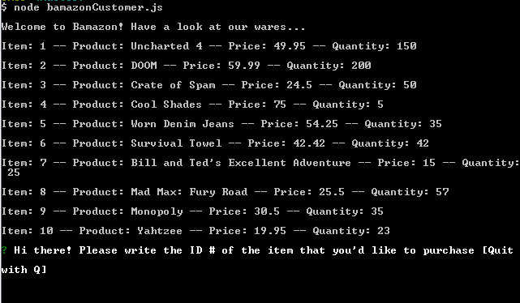
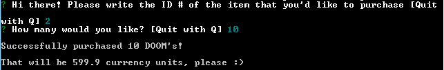

# Bamazon-Node-App: Customer

A take on the classic bargain-hunter using the command line in Node.js and databases in Sequel Pro/MySQL.

To begin:

1.  Open up terminal/bash on your PC and navigate into the Bamazon-Node-App folder
2.  Double-check that you're inside the Customer version of this application, then load the schema.sql file into your application so that     your database is set.  On MySQL WorkBench, it's as easy as writing "mysql -u <username> -p <password>" and writing "source                 schema.sql".  If you're using Sequel Pro and have any questions on getting your database populated, check out this video                   (https://www.youtube.com/watch?v=GFBwvrVpCOI) that will walk you through the process of creating our schema.sql file on Sequel Pro.
3.  Begin using the app by writing "node bamazonCustomer.js"
4.  You will see the table listing all of the products from the SQL database bamazon
  
  
  
5.  Select an item that appeals to you and continue ordering the specified quantity.
6.  At the completion of your transaction, the app will indicate the total you owe Bamazon and wish you on your way.

7.  If you decide to purchase another item, you may. Notice that the app will not allow you to purchase more than is in stock. You can          "thank" the management for this one.
8.  Please let me know if you have any questions! I hope you enjoy using this app as much as I enjoy publishing it :)

~KHW
