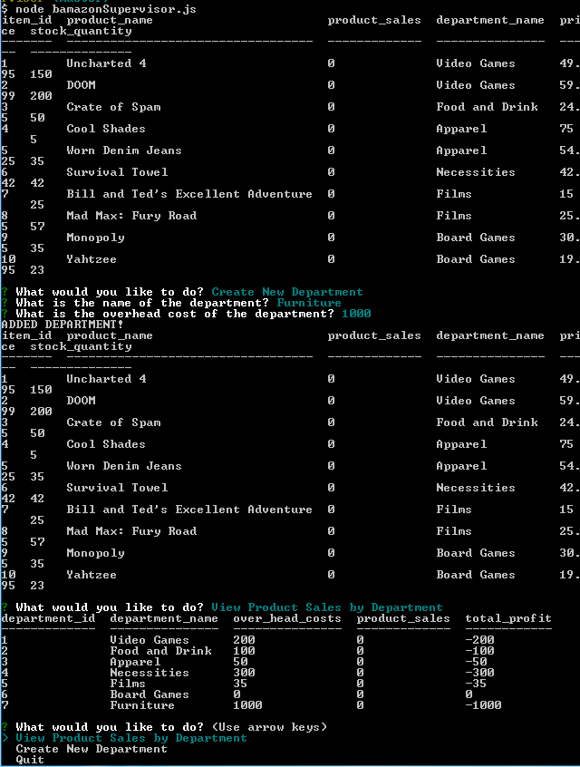

Bamazon-Node-App

A take on the classic bargain-hunter using the command line in Node.js and databases in Sequel Pro/MySQL.

To begin:

1. Open up terminal/bash on your PC and navigate into the Bamazon-Node-App folder
2. Double-check that you're inside the Manager version of this application, then load the schema.sql file into your application so that      your database is set. On the MySQL Command-Line Interface (CLI), it's as easy as writing "mysql -u <username> -p <password>" and          writing "source schema.sql" (follow this video if you have any questions: https://www.youtube.com/watch?v=6HSVXJZk0aE).  If you're        using Sequel Pro and have any questions on getting your database populated, check out this video 
   (https://www.youtube.com/watch?v=GFBwvrVpCOI) that will walk you through the process of creating our data table on Sequel Pro.
3. Begin using the app by writing "node bamazonSupervisor.js"
4. You will be prompted with the options to view product sales by department, create a new department, or quit the application
5. Any changes to the department records are reflected on the Sequel Pro or MySQL database. You can "thank the management" for this one.
  
    
  
6. Please let me know if you have any questions! I hope you enjoy using this app as much as I enjoy publishing it :)
~KHW
